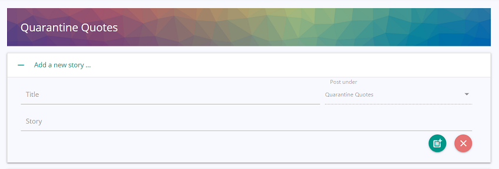

# Lets Talk Corona

## Description 

 
 

Lets Talk Corona is a blogging platform where people come together to share stories and posts about the pandemic. Posting new content is limited to registered users, but anyone who visits the site can view all public posts by our users. Registered users can post new stories and update them.

We have the following broad categories under which users can share their stories:
* Everyday heroes - stories about bravery, kindness, selflessness and support
* Quarantine quotes - funny stories on the new covid rules, quarantine and isolation  
* Healing space - a space to share your pain, fears and troubles 
* Newsworthy - facts, news and everything else thats interesting
 

*The application is deployed on Heroku at the below link:*

[Lets Talk Corona - https://lets-talk-corona.herokuapp.com/](https://lets-talk-corona.herokuapp.com/)
 
 

## Table of Contents 

- [Technical Features](#technical-features)
 - [Full Stack](#full-stack)
 - [User Authentication and Security](#user-authentication-and-security)
 - [Testing and Deployment](#testing-and-deployment)
 - [MVC](#mvc)
 - [Responsive Web Design](#responsive-web-design)
- [Usage Guidelines](#usage-guidelines)

 

## Technical Features
### Full Stack 
The front end of this application is built using Materialize component library along with JQuery and is rendered using the Express Handlebars templating engine. 

The backend is powered by Node.js, with Express as the server and MySQL as the database. We also used sequelize as the ORM for our models.

This makes it a full stack application having both front and back end components. 

### User Authentication and Security

We used express-session and passport middlewares for maintaining user sessions and authenticating our user requests. Additionally, all passwords in the system are hashed using bcryptjs before being persisted. This security feature prevents any person with access to the database from being able to view or use the passwords of users in the system.   

### Testing and Deployment
We used ESLint for code analysis and testing of our application. And Travis continuous integration services to automate our tests and deploy the application onto Heroku after every successful build. 

### MVC 
Lets Talk Corona follows the Model View Controller(MVC) architectural pattern. Using the MVC pattern helps modularize the application by separating the user interface, the business logic, and the data access logic into different components. This in turn increases flexibility, maintainability and scalability of the application.

### Responsive Web Design 
Responsive web design provides better accessibility and an optimal viewing experience to the user, by ensuring that web pages render well on different devices and window / screen sizes. To achieve this, We have used the Materialize front-end component library to build our pages. 

## Usage Guidelines

When the Lets Talk Corona application is opened, it loads up all the stories saved in the system and displays the below page:  

   

* Users can then browse all stories in the system or select a category from the left hand panel to view stories specific to that category.
* To add a new story, the user needs to register and login. If the user has an account in the system, they can click the `sign in to add a new story` link in the stories page or the `sign in` link from the menu bar to access the sign in page shown below:  

   

* The user can then enter their credentials, and if validated they are then logged in to the system, and can see the below homepage:   
  
   

* To add a new Story click the `+ Add a new Story` link to view:  
  
   

* Enter the story details and click the post button to add a new story.
* Click the clear button to clear the data entered.
* To collapse the new story panel, click the `+ Add a new Story` link again.
* To delete a story posted by the user, they can choose the delete story button on the right of the story. This deletes the story and displays a brief message.
* The user can also choose to edit a story posted by them by clicking the edit icon. This opens the edit story view:  
  
   

* Once the user modifies the story and clicks the save button, a message is displayed to the user, and the page navigates back to the previous story list view. 
* If the user chooses cancel, the story is not updated and the user returns to the previous story list view.
* The user can view all stories posted by them in the user profile view by clicking the `profile` link from the top menu bar. It opens the below view:
:  
  
   

 * Users can then choose to add / edit / delete their stories from this view as well.
 * To log out of the system, users can choose the `logout` link from the top menu bar.
 * To create a new account, click the `Create Account` button from the top menu bar, This opens the below page:
:  
  
     

* On entering user details, validating the password, and clicking the `Sign Up` button, a new user account is created in the system and the user is automatically logged in to the account.
* The user / login name entered must be alpha-numeric. If any other characters are entered, the system displays a validation error message. 
* The user / login name should be unique. If a user by the same name exists, the system displays a validation error message. 